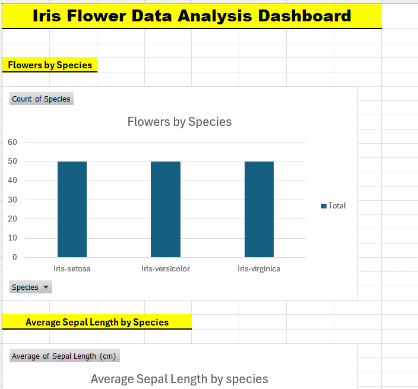
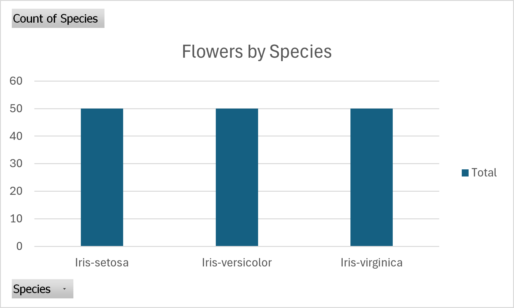

# 📊 Data Analytics Portfolio — Shilpa Philipose

Welcome to my **Data Analytics Portfolio**.

This repository showcases my hands-on data analytics work using **Microsoft Excel, SQL, and Python**. The projects demonstrate my ability to organize and validate data, perform analysis, create visualizations, and communicate meaningful findings.

---

## 👩‍💻 About Me

I am an aspiring **Data Analyst** with experience in administrative operations, data handling, reporting, data validation, and documentation.

I am developing my data analytics skills through practical projects using **Excel, SQL, and Python**, with a focus on transforming raw data into clear and useful insights.

---

## 🛠️ Skills & Tools

### Data Analytics

* Data Cleaning & Validation
* Data Exploration
* Descriptive Statistics
* Data Aggregation
* Data Interpretation
* Reporting & Documentation

### Technical Tools

* **Microsoft Excel**
* **SQL**
* **Python**
* **Pandas**
* **Matplotlib**
* **Google Colab**
* **GitHub**

---

# 📁 Project 1 — Iris Flower Data Analysis

## 📌 Project Overview

This project analyzes the **Iris Flower Dataset** using Microsoft Excel and SQL, with Python used for additional analysis and visualization.

The project explores flower measurements across three Iris species and identifies patterns and relationships between sepal and petal measurements.

### 🌸 Iris Species

* Iris-setosa
* Iris-versicolor
* Iris-virginica

---

## 🎯 Project Objectives

* Explore and validate the dataset
* Organize and clean data
* Perform descriptive statistical analysis
* Create summary tables using Excel
* Analyze the dataset using SQL
* Calculate averages, minimums, and maximums
* Compare flower measurements by species
* Create data visualizations
* Identify relationships between petal measurements
* Communicate analytical findings

---

# 📊 Excel Analysis

Microsoft Excel was used to organize, analyze, and visualize the Iris dataset.

### Excel Tasks

* Data organization and formatting
* Data cleaning and validation
* Sorting and filtering
* Basic statistical calculations
* Summary tables
* Species-level comparisons
* Comparison of sepal and petal measurements
* Data visualization

### Excel Files

📁 [Iris Dashboard.xlsx](Iris%20Dashboard.xlsx)

📁 [Raw Data.xlsx](Raw%20Data.xlsx)

---

# 🔎 SQL Analysis

SQL was used to query and analyze the Iris dataset.

### SQL Tasks

* Count total records
* Count flowers by species
* Calculate average measurements
* Find minimum and maximum values
* Filter records
* Sort measurements
* Group data by species
* Compare species-level measurements

### Sample SQL Queries

```sql
SELECT *
FROM iris_dataset_from_kaggle;

SELECT COUNT(*) AS Total_Flowers
FROM iris_dataset_from_kaggle;

SELECT Species, COUNT(*) AS Total
FROM iris_dataset_from_kaggle
GROUP BY Species;

SELECT Species, ROUND(AVG(SepalLengthCm), 2) AS Avg_Sepal_Length
FROM iris_dataset_from_kaggle
GROUP BY Species;

SELECT Species, ROUND(AVG(PetalLengthCm), 2) AS Avg_Petal_Length
FROM iris_dataset_from_kaggle
GROUP BY Species;

SELECT MAX(PetalLengthCm) AS Largest_Petal
FROM iris_dataset_from_kaggle;

SELECT MIN(SepalWidthCm) AS Smallest_Sepal_Width
FROM iris_dataset_from_kaggle;

SELECT *
FROM iris_dataset_from_kaggle
WHERE PetalLengthCm > 5;

SELECT Species, SepalLengthCm
FROM iris_dataset_from_kaggle
ORDER BY SepalLengthCm DESC;
```

### SQL Files

📄 [View SQL Analysis](iris_analysis.sql)

📄 [View SQL Documentation](Iris%20SQL.docx)

---

# 🐍 Python Analysis

Python was used to perform additional data analysis and visualization.

### Python Tasks

* Data inspection
* Data type checking
* Missing-value checking
* Descriptive statistics
* Minimum and maximum analysis
* Species frequency analysis
* Average measurements by species
* Petal length and width relationship analysis
* Data visualization

### Python Libraries

```python
import pandas as pd
import matplotlib.pyplot as plt
```

---

# 📈 Data Visualizations

The project includes several visualizations created during the analysis.

### Iris Dashboard



### Distribution of Sepal Length


### Petal Length vs Petal Width


### Petal Length


### Sepal Length


### Species Distribution



---

# 🔍 Key Findings

* **Iris-setosa** has the smallest average petal measurements.
* **Iris-virginica** has the largest average petal measurements.
* **Iris-versicolor** generally falls between setosa and virginica.
* Petal length and petal width show a clear positive relationship.
* Petal measurements provide useful distinctions between the three Iris species.
* The three Iris species can be visually differentiated based on their measurements.

---

# 📂 Dataset

The project uses the **Iris Flower Dataset**.

📄 [View Iris Dataset](Iris%20Dataset%20from%20Kaggle.csv)

The dataset contains:

* Sepal Length
* Sepal Width
* Petal Length
* Petal Width
* Species

---

# 💡 Skills Demonstrated

* Microsoft Excel
* SQL
* Python
* Pandas
* Matplotlib
* Data Cleaning
* Data Validation
* Data Analysis
* Descriptive Statistics
* Data Visualization
* Summary Tables
* Data Interpretation
* Reporting
* GitHub

---

# 🚀 Project Outcome

This project demonstrates an end-to-end beginner-level data analytics workflow, from organizing and validating raw data to performing analysis using Excel and SQL, extending the analysis with Python, creating visualizations, and communicating key findings.

---

## 🔮 Future Projects

Additional projects will be added to this portfolio as I continue developing my skills in:

* Power BI
* Business Intelligence
* Advanced SQL
* Python Data Analysis
* Interactive Dashboards

---

## 📫 Connect with me:

**Shilpa Philipose**

Calgary, Alberta, Canada

---

⭐ Thank you for visiting my Data Analytics Portfolio!
